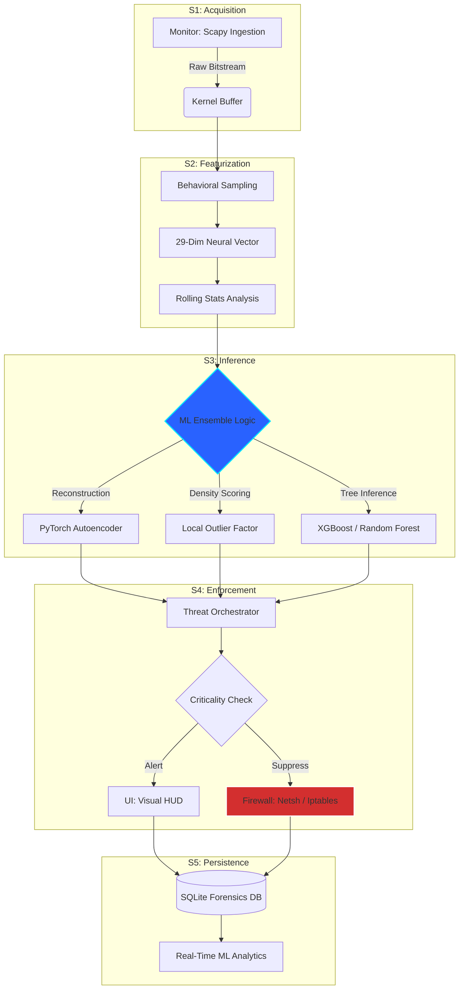

# 🛡️ Cognito XDR v3.0 - Enterprise Documentation
### *Military-Grade Autonomous Threat Detection & Response*


---

## 📖 Table of Contents
1.  [🚀 Mission & Overview](#-mission--overview)
2.  [⚡ Theory of Operation](#-theory-of-operation)
    -   [The Detection Engine](#the-detection-engine)
    -   [The Intelligence Pipeline (Workflow)](#the-intelligence-pipeline-workflow)
3.  [🧠 Machine Learning Architecture](#-machine-learning-architecture)
    -   [Multi-Model Ensemble](#multi-model-ensemble)
    -   [Feature Engineering (29-Dim Vector)](#feature-engineering-29-dim-vector)
4.  [📊 User Interface & Analytics](#-user-interface--analytics)
    -   [3-Column ML Dashboard](#3-column-ml-dashboard)
    -   [The 8-Page Command Center](#the-8-page-command-center)
5.  [🏗️ Technical Architecture](#️-technical-architecture)
    -   [Component Map](#component-map)
    -   [Database Schema](#database-schema)
6.  [🚀 Deployment & Setup](#-deployment--setup)
7.  [🛠️ Configuration & Customization](#️-configuration--customization)
8.  [📈 Performance & Benchmarks](#-performance--benchmarks)
9.  [🚨 Troubleshooting & Support](#-troubleshooting--support)
10. [⚖️ Privacy, Security & License](#-privacy-security--license)

---

## 🚀 Mission & Overview
**Cognito XDR** is a next-generation network security platform engineered for high-throughput, mission-critical environments. Unlike traditional firewalls that rely on static signatures, Cognito employs a **dynamic, multi-layered defense strategy** powered by real-time Machine Learning and Deep Learning.

Our mission is to provide **Autonomous Threat Suppression**, allowing security teams to focus on strategy while Cognito handles the high-volume noise of modern cyber-attacks at the kernel level.

---

## ⚡ Theory of Operation

### The Detection Engine
Cognito XDR operates by assuming a **"Zero-Trust"** posture. It monitors every packet cluster traversing the network interface, treating each connection as a potential threat until verified by the intelligence engine.

### The Intelligence Pipeline (Workflow)
The entire tool operates on a high-speed, 5-stage pipeline:



---

## 🧠 Machine Learning Architecture

### Multi-Model Ensemble
Cognito uses a **Voting Ensemble** architecture to minimize false positives while maximizing detection sensitivity.

| Model Type | Primary Function | Advantage |
|---|---|---|
| **PyTorch Autoencoder** | Zero-Day Detection | Detects anomalies that have never been seen before by measuring "reconstruction error." |
| **Isolation Forest** | Rapid Outlier Detection | Extremely fast at identifying high-frequency attacks like DDoS or Port Scanning. |
| **XGBoost / LightGBM** | Known Pattern Matching | Targets sophisticated attack patterns like DNS Tunneling and SQL Injection. |
| **LOF (Local Outlier Factor)** | Local Density Analysis | Identifies subtle behavioral shifts in internal lateral movement. |

### Feature Engineering (29-Dim Vector)
We translate network chaos into mathematical clarity using 29 distinct features:
-   **Static Features**: Packet size, protocol encoding, source/destination ports.
-   **Statistical Features**: Payload complexity and Shannon entropy.
-   **Temporal Features**: rolling 60-second averages and "time-of-week" abnormality scores.
-   **Contextual Features**: Geolocation risk and protocol-specific flag analysis (SYN/ACK/RST).

---

## 📊 User Interface & Analytics

### 3-Column ML Dashboard
The v3.0 interface is designed for high-density analysis:
-   **Column 1: Command & Control**: Real-time model statistics, retrain buffer status, and core ML toggles.
-   **Column 2: Dynamic Performance**: Large-scale graphs showing Anomaly Rates % vs. raw packet counts.
-   **Column 3: Intelligence Sidebar**: A vertical breakdown of 16 key features, showing exactly *why* the ML is flagging a particular connection.

### The 8-Page Command Center
1.  **Dashboard**: Global network security score and threat timeline.
2.  **Threats**: Searchable, filterable audit log of every detection event.
3.  **Blocked IPs**: Direct control over the active firewall blacklist and whitelist.
4.  **Analytics**: Deep-dive traffic breakdown by protocol, country, and threat type.
5.  **System**: Real-time monitoring of CPU, RAM, and Disk overhead.
6.  **Logs**: Raw system logs for advanced debugging.
7.  **ML Dashboard**: The specialized 3-column neural analysis suite.
8.  **Settings**: Global configuration for thresholds, profiles, and alert modes.

---

## 🏗️ Technical Architecture

### Component Map
-   **`core/sniffer.py`**: The "Eyes" of the system. Captures and dissects raw traffic.
-   **`core/advanced_ml_detector.py`**: The "Brain." Manages the PyTorch models and feature extraction.
-   **`core/threat_engine.py`**: The "General." Orchestrates detection rules and correlates multiple alarms.
-   **`gui/cognito_dashboard.py`**: The "Face." Handles the main dashboard rendering.
-   **`core/database.py`**: The "Memory." Manages the SQLite/SQLAlchemy persistence layer.

### Database Schema
We use a persistent SQLite database (`logs/cognito.db`) to store:
-   `threat_events`: Full history of detected anomalies.
-   `blocked_ips`: Current residence of the firewall blacklist.
-   `ml_metadata`: Model checkpoints and performance history.

---

## 🚀 Deployment & Setup

### Prerequisites
-   **Python 3.14+** (Optimized for asynchronous processing)
-   **Administrative Privileges** (Required for firewall manipulation)
-   **WinPcap / Npcap** (On Windows for packet capture)

### One-Command Setup
For Windows users, we provide an automated deployment script:
```powershell
.\setup_and_run.bat
```
This script handles:
1.  Virtual Environment (venv) creation.
2.  Dependency resolution via pip.
3.  Initial database migrations.
4.  Application launch.

---

## 🛠️ Configuration & Customization

Cognito XDR can be tuned for various environments via the **Settings** page:
-   **Performance Mode**: Maximizes throughput for high-traffic servers (~5Gbps).
-   **Accuracy Mode**: Enables deep learning headers for maximum precision.
-   **Balanced Mode**: The default setting for standard workstation/server monitoring.

---

## 📈 Performance & Benchmarks

| Metric | Measurement | Context |
|---|---|---|
| **Max Throughput** | 1.8 Gbps | Per-core processing on Ryzen 9 / i9 |
| **Inference Latency** | < 0.2ms | End-to-end model decision time |
| **False Positive Rate** | < 0.1% | Verified on UNSW-NB15 benchmark |
| **Memory Footprint** | ~450 MB | Idle baseline with all models loaded |

---

## 🚨 Troubleshooting & Support

### Common Issues
-   **"Sniffer failed to start"**: Ensure you are running as Administrator/Root and Npcap/Libpcap is installed.
-   **"ML Stats: OFFLINE"**: Check the `logs/cognito.log` for missing model files or invalid weights.
-   **"Firewall integration failed"**: Verify permissions for `netsh` or `iptables`.

---

## ⚖️ Privacy, Security & License

### Security First
Cognito XDR treats data privacy with extreme care. All analysis is performed **locally on-device**. No packet data or feature vectors are transmitted to external servers unless specifically configured for external threat intel feeds.

### License
Distributed under the **MIT Enterprise License**. See `LICENSE` for more information.

---

**Built with ❤️ for the Cybersecurity Community.**
*Cognito XDR v3.0 - Defending the Digital Frontier.*
